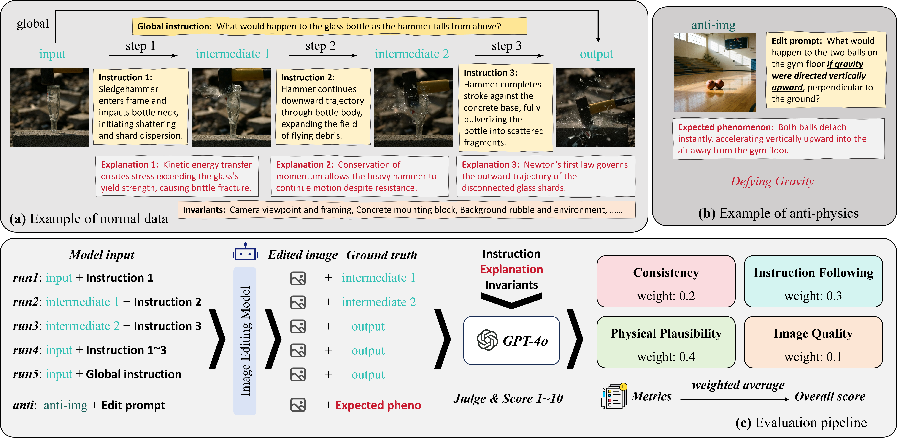

<div align="center">

<h1>PhyEditBench: A Real-World Multi-Stage Benchmark for Physics-Aware Image Editing</h1>

[Shengbin Guo*](https://previsior.github.io/) &nbsp;&nbsp; [Shaokang He*](https://openreview.net/profile?id=~Shaokang_He2) &nbsp;&nbsp; [Chaoyue Meng](https://openreview.net/profile?id=~Chaoyue_Meng1) &nbsp;&nbsp;[Shengpeng Xiao](https://openreview.net/profile?id=~Shengpeng_Xiao2)<br>[Xunzhi Xiang](https://xbxsxp9.github.io/) &nbsp;&nbsp;[Shaofeng Zhang](https://sherrylone.github.io/) &nbsp;&nbsp;[Qi Fan†](https://fanq15.github.io/)
<br>

<sup>* equal contribution &nbsp;&nbsp; † corresponding author</sup>

<p align="center">
    📖 <a href="https://github.com/Previsior/PhyEditBench"><b>Project Page</b></a> &nbsp&nbsp  | &nbsp&nbsp 🤗 <a href="https://huggingface.co/datasets/Previsior-PhyEdit/phyedit-bench">PhyEditBench</a> &nbsp&nbsp | &nbsp&nbsp 🤗 <a href="https://huggingface.co/datasets/Previsior-PhyEdit/phyedit-video">PhyEditVideo</a> &nbsp&nbsp | &nbsp&nbsp 📑 <a href="">Arxiv</a>
</p>

</div>

<!-- # PhyEditBench
PhyEditBench: A real-world multi-stage benchmark for evaluating physics-aware reasoning in instruction-guided image editing. -->

## 🪧 News
- **[2026.6.24]** The benchmark and evaluation code have been released!
- **[2026.6.19]** 🎉 PhyEditBench is accepted by ECCV 2026!


## 📌 Overview


**PhyEditBench** is a real-world multi-stage benchmark for evaluating physics-aware image editing. It contains **238 high-quality real-world instances** and **35 synthetic Anti-Physics instances**, covering **4 primary physical classes** and **12 subclasses**, including deformation and fracture, fluid dynamics, rigid-body interactions, and state change with environmental effects.

Each real-world instance is organized as a four-state physical trajectory—input, intermediate state 1, intermediate state 2, and output—enabling both fine-grained step-wise evaluation and holistic global editing evaluation. Specifically, models are tested under five settings: three step-wise edits between consecutive states, one multi-step edit using aggregated instructions, and one global edit from the initial state to the final state.

Anti-Physics cases further test whether models can follow counterfactual physical rules rather than relying on common visual priors. We evaluate model outputs with a unified VLM-based judge across four metrics: **Consistency**, **Instruction Following**, **Physical Plausibility**, and **Image Quality**, with Physical Plausibility receiving the highest weight to emphasize physically coherent editing.



## 🔥 Benchmark Performance

We evaluate representative image editing models on **PhyEditBench** using a unified VLM-based scoring protocol. Each output is scored from 1 to 10 across four dimensions: **Consistency**, **Instruction Following**, **Physical Plausibility**, and **Image Quality**. The overall score is computed as a weighted average of these metrics. We also report the model performance across four major physical categories: **Deformation & Fracture**, **Fluid Dynamics**, **Rigid Body & Interaction**, and **State Change & Environment**.

<div align="center">
<p align="center">📊 Overall performance and metric breakdown</p>

| Rank | Model | Overall | Consistency | Instruction Following | Physical Plausibility | Image Quality |
|:---:|:---|:---:|:---:|:---:|:---:|:---:|
| 🥇 1 | ChronoEdit-14B | **8.51** | **9.67** | **7.98** | **8.42** | **8.13** |
| 🥈 2 | Seedream4.0 | 8.47 | 9.69 | 8.22 | 8.22 | 7.75 |
| 🥉 3 | GPT-Image-1.5 | 8.23 | 8.84 | 8.21 | 8.30 | 6.78 |
| 4 | UniWorld-V2 | 7.08 | 8.53 | 6.78 | 6.73 | 6.45 |
| 5 | Step1X-Edit | 6.79 | 9.24 | 5.93 | 6.19 | 6.87 |
| 6 | Qwen-Image-Edit | 6.71 | 8.41 | 6.35 | 6.37 | 5.79 |
| 7 | Gemini-2.5 | 6.51 | 7.21 | 6.13 | 6.64 | 5.72 |
| 8 | BAGEL-Think | 6.43 | 8.53 | 5.72 | 5.96 | 6.26 |
| 8 | PhyWorld | 6.43 | 7.58 | 5.89 | 6.30 | 6.26 |
| 10 | BAGEL | 6.09 | 7.82 | 5.47 | 5.69 | 6.04 |
| 11 | InstructPix2Pix | 5.61 | 7.08 | 4.16 | 5.58 | 7.12 |
| 12 | Frame2Frame | 5.38 | 7.96 | 4.08 | 4.73 | 6.65 |
| 13 | OmniGen2 | 5.36 | 6.35 | 4.23 | 5.54 | 5.96 |
| 14 | FLUX.1-Kontext-dev | 5.27 | 7.03 | 4.56 | 4.81 | 5.71 |

<p align="center">🧩 Performance across physical categories</p>

| Rank | Model | Overall | Deformation & Fracture | Fluid Dynamics | Rigid Body & Interaction | State Change & Environment |
|:---:|:---|:---:|:---:|:---:|:---:|:---:|
| 🥇 1 | ChronoEdit-14B | **8.51** | **8.38** | **8.74** | **8.32** | **8.79** |
| 🥈 2 | Seedream4.0 | 8.47 | 7.43 | 9.04 | 8.65 | 8.84 |
| 🥉 3 | GPT-Image-1.5 | 8.23 | 8.36 | 8.30 | 7.91 | 8.51 |
| 4 | UniWorld-V2 | 7.08 | 6.60 | 7.43 | 6.99 | 7.44 |
| 5 | Step1X-Edit | 6.79 | 3.16 | 7.20 | 6.77 | 7.13 |
| 6 | Qwen-Image-Edit | 6.71 | 6.41 | 7.38 | 6.10 | 7.33 |
| 7 | Gemini-2.5 | 6.51 | 7.36 | 6.79 | 5.87 | 6.07 |
| 8 | BAGEL-Think | 6.43 | 5.77 | 6.82 | 6.55 | 6.59 |
| 8 | PhyWorld | 6.43 | 6.29 | 6.55 | 6.10 | 6.94 |
| 10 | BAGEL | 6.09 | 5.55 | 6.43 | 6.21 | 6.14 |
| 11 | InstructPix2Pix | 5.61 | 4.24 | 6.41 | 5.49 | 6.67 |
| 12 | Frame2Frame | 5.38 | 5.25 | 5.43 | 5.17 | 5.86 |
| 13 | OmniGen2 | 5.36 | 3.71 | 6.32 | 5.51 | 6.05 |
| 14 | FLUX.1-Kontext-dev | 5.27 | 5.40 | 5.37 | 4.99 | 5.44 |


<p align="center">Qualitative results of some models.</p>

</div>


## ⚙️ Usage
The benchmark data are stored in [`bench`](bench). Normal samples are organized by physical category and subclass; each `meta.json` item contains four trajectory states (`input`, `intermediate_1`, `intermediate_2`, `output`), three step-wise instructions, one global instruction, physical explanations, and invariants. Anti-Physics samples are stored in `bench/anti-physic` with `meta.jsonl`, `input_data/`, and the provided `checklists.jsonl`.

### Requirements

Use Python 3.10 or newer and install the evaluation dependencies:

```bash
pip install openai pillow tqdm
```

### Evaluation

Set your OpenAI API key:

```bash
export OPENAI_API_KEY="YOUR_API_KEY"
```

Generated outputs should be saved in the following structure. Use the numeric sample id as the filename, without the `data_` prefix.

```text
bench_generated/
    <ModelName>/
        <PrimaryClass>/
            <SubClass>/
                TypeA/<id>.png
                TypeB/<id>.png
                TypeC/<id>.png
                TypeD/<id>.png
                TypeE/<id>.png
        anti-physic/
            <id>.png
```

- `<ModelName>`: The name of the image editing model being evaluated, such as `BAGEL`.
- `<PrimaryClass>`: One of the four primary physical categories in `bench`: `Deformation_&_Fracture`, `Fluid_Dynamics`, `Rigid_Body_&_Interaction`, or `State_Change_&_Environment`.
- `<SubClass>`: The subclass folder under each primary category, such as `brittle_fracture`, `Pouring_&_Flow`, or `Gravity_&_Fall`.
- `<id>`: The numeric sample id from the benchmark metadata. Generated filenames should be `<id>.png`, for example `12.png`.

The five normal evaluation types correspond to the paper settings:

| Type | Input state | Target state | Instruction |
|:---:|:---|:---|:---|
| TypeA | input | intermediate_1 | step 1 |
| TypeB | intermediate_1 | intermediate_2 | step 2 |
| TypeC | intermediate_2 | output | step 3 |
| TypeD | input | output | concatenated step instructions |
| TypeE | input | output | global instruction |

Run the normal benchmark evaluation:

```bash
python gpt_eval.py --model_name <ModelName> --output ./bench_scores
```

Run the Anti-Physics evaluation:

```bash
python gpt_eval_anti.py --model_name <ModelName> --output ./bench_scores
```

The normal script writes `bench_scores/<ModelName>_normal_scores.jsonl` and `bench_scores/<ModelName>_normal_summary.json`. The Anti-Physics script writes `bench_scores/<ModelName>_anti_scores.jsonl` and `bench_scores/<ModelName>_anti_summary.json`. The normal summary reports `overall`, `by_dimension`, `by_type`, `by_primary`, and `by_primary_sub`; the Anti-Physics summary reports `overall`, `by_dimension`, and `by_data_type`.

<!-- For a no-cost path check, run a dry run:

```bash
python gpt_eval.py --model_name <ModelName> --limit 1 --types TypeA --dimensions consistency --dry_run
python gpt_eval_anti.py --model_name <ModelName> --limit 1 --dry_run
```

For a minimal API smoke test, evaluate one normal image on one dimension and one Anti-Physics image:

```bash
python gpt_eval.py --model_name <ModelName> --limit 1 --types TypeA --dimensions consistency --output ./tmp_eval
python gpt_eval_anti.py --model_name <ModelName> --limit 1 --output ./tmp_eval
```

The code uses the official OpenAI Python SDK. For local debugging with an OpenAI-compatible endpoint, you may set `OPENAI_BASE_URL` or pass `--base_url`; leave it unset for the official OpenAI API. -->

### PhyWorld
<!-- 可以单独写一个说明 md 文件 -->

## Citation
